# Threat Intel Aggregation & IOC Enrichment Pipeline
Personal Project | Blue Team / CTI | 2026

Automated threat intelligence pipeline that ingests IOCs from multiple
open-source CTI feeds, scores them by confidence, enriches via external
APIs, and pushes actionable intel into a Wazuh SIEM as live detection lists.

Detailed technical writeup: [WRITEUP.md](WRITEUP.md)

---

## 🔥 Highlights

- Ingests IOCs from OTX AlienVault, abuse.ch URLhaus, and Feodo Tracker
- Confidence scoring engine factoring recency, source reputation, and
  cross-feed corroboration
- Automated enrichment via AbuseIPDB and VirusTotal APIs with rate-limit handling
- Exports high-confidence IOCs directly into Wazuh CDB lists for real-time
  log correlation and alerting
- Fully automated via systemd timer — runs every 6 hours on Arch Linux
- CLI interface for manual control: ingest, score, enrich, export, report

---

## 🛠️ Skills Used

`Python` `SQLite` `Wazuh` `CTI Feed Analysis` `IOC Enrichment`
`AbuseIPDB API` `VirusTotal API` `OTX AlienVault` `abuse.ch`
`Confidence Scoring` `SIEM Integration` `systemd` `Arch Linux`
`Threat Intelligence` `Detection Engineering` `Blue Team`

---

## 📸 Screenshots

### Pipeline Architecture

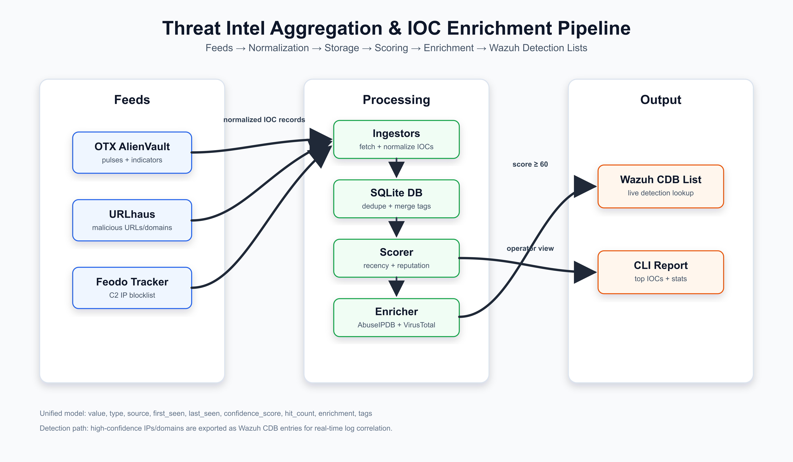

Editable source: [`assets/diagrams/architecture.drawio`](assets/diagrams/architecture.drawio)

This diagram shows the complete IOC lifecycle. Feed-specific ingestors pull
raw CTI from URLhaus, Feodo Tracker, and OTX, normalize each record into a
shared schema, then store it in SQLite for deduplication and scoring. Keeping
ingestion, scoring, enrichment, and export as separate stages makes the
pipeline easier to debug and extend. In a Blue Team workflow, this separation
also matters operationally: noisy feed ingestion should not directly become
SIEM detection logic until confidence scoring and enrichment have filtered it.

---

### 1️⃣ Feed Ingestion

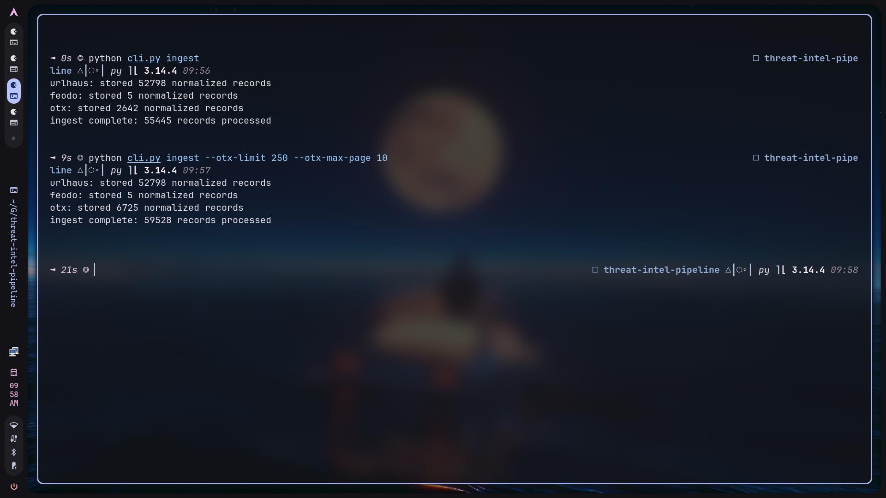

This screenshot proves the pipeline can ingest all three configured CTI
sources. URLhaus contributes malicious URLs and derived domains/IPs, Feodo
contributes curated C2 IPs, and OTX contributes broader community-sourced
indicators from pulses. The important engineering detail is that each feed has
different raw fields and formats, but the ingestors normalize everything into
the same IOC model before storage. This makes later stages feed-agnostic.

---

### 2️⃣ SQLite Storage & Deduplication

**A. Database Stats After Full Ingest**

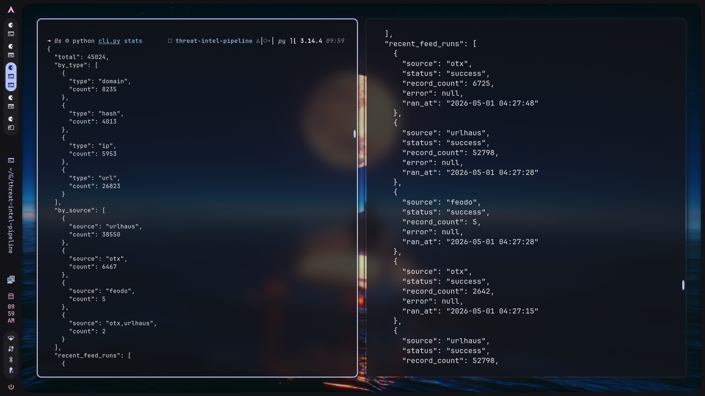

The stats output validates that ingestion produced queryable data in SQLite.
It shows total IOC volume, breakdown by IOC type, breakdown by source, and the
latest feed run results. This is useful for operations because it gives quick
feed health visibility: if one source starts failing, the pipeline records that
failure instead of silently producing stale detections.

**B. Deduplication in Action**

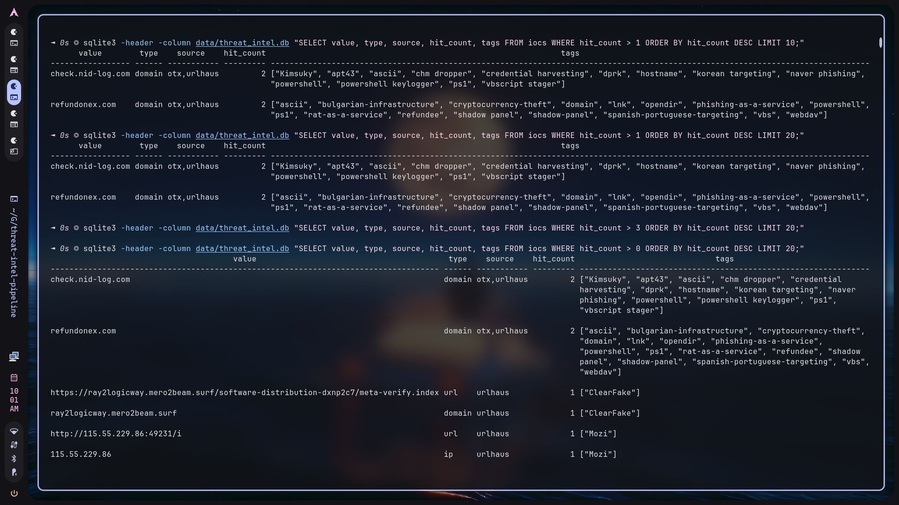

This query demonstrates deduplication and source/tag merging. The database uses
`UNIQUE(value, type)` so repeated indicators do not create duplicate rows.
Instead, repeated or corroborated observations update `last_seen`, merge tags,
merge sources, and update `hit_count`. That matters because a single IOC seen
across multiple feeds is stronger signal than an IOC seen once in one noisy
community feed.

---

### 3️⃣ Confidence Scoring Engine

**Score Distribution**

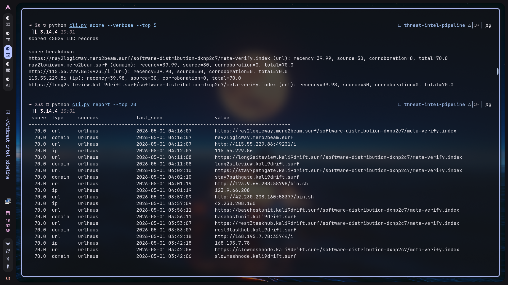

The scoring screenshot shows how raw IOCs become prioritized intelligence. The
score combines recency, source reputation, and cross-feed corroboration. Recent
URLhaus or Feodo indicators naturally score higher than stale indicators, and
multi-source sightings increase confidence. This prevents the pipeline from
treating every feed entry as equally actionable, which is critical when the
output becomes live SIEM detection content.

---

### 4️⃣ API Enrichment

**Enrichment Output and Database Verification**

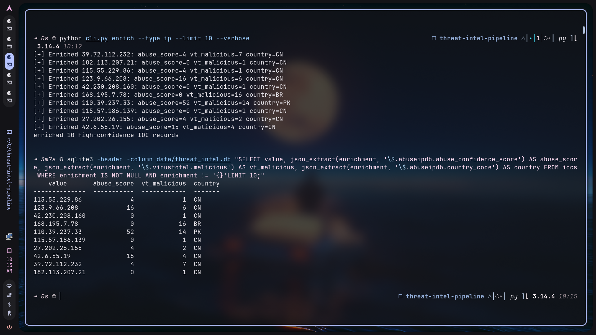

The enrichment step adds external context to high-confidence IOCs. For IPs,
AbuseIPDB provides abuse confidence, country, ISP, and usage type, while
VirusTotal provides malicious/suspicious engine counts. The SQLite query proves
the enrichment is persisted as JSON in the `enrichment` column. Storing this as
JSON keeps the schema simple while preserving full API detail for reporting or
future detection logic.

---

### 5️⃣ Wazuh CDB Export & Live Detection

**A. CDB List File Contents**

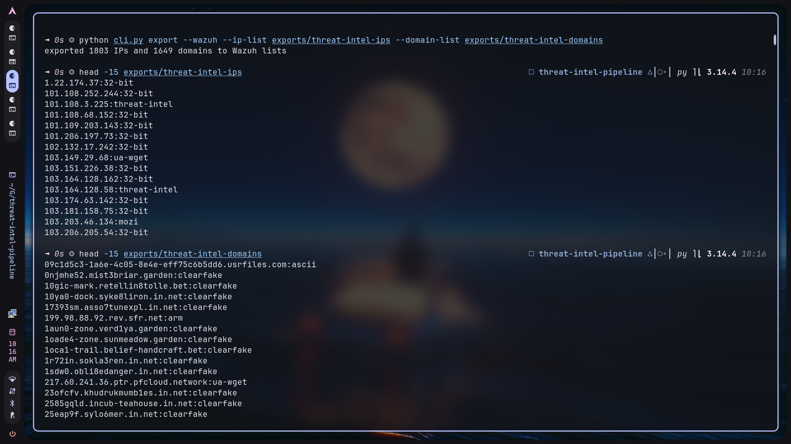

The exporter converts high-confidence IPs and domains into Wazuh CDB list
format: `indicator:label`. This screenshot shows the local export path used
for Docker-based Wazuh deployments. The purpose is to move from passive
intelligence storage to active detection content. Once loaded by Wazuh, these
lists can be queried during log analysis in real time.

**B. Wazuh Custom Rule**

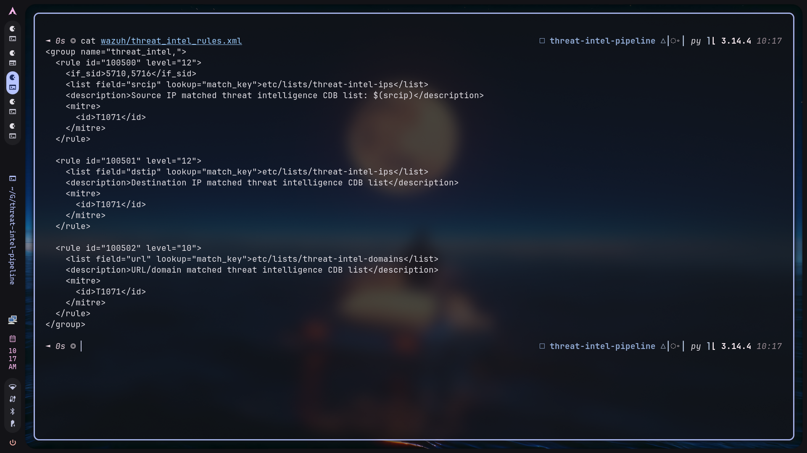

The custom Wazuh rule connects decoded log fields to the exported CDB lists.
For SSH events, the rule checks `srcip` against `etc/lists/threat-intel-ips`
after the built-in SSH failure rules have decoded the source IP. The rule ID,
severity level, MITRE mapping, and description make the alert actionable in the
SIEM. This is the point where CTI becomes detection engineering.

**C. Docker Deployment Into Wazuh Manager**

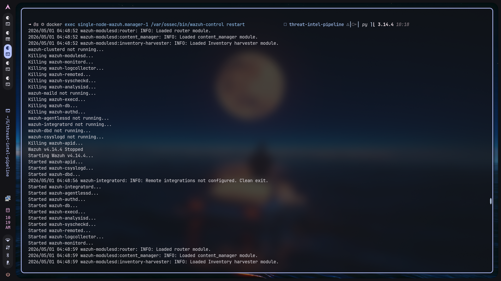

Because this Wazuh stack runs in Docker, the CDB lists must be copied into the
manager container rather than written to host `/var/ossec`. This screenshot
shows the operational deployment path: copy lists and rules into the manager,
fix ownership and permissions, register the lists in Wazuh configuration, and
restart the manager. This validates the pipeline against a realistic
containerized Wazuh setup.

**D. Wazuh Logtest Alert Firing on a Matched IOC**

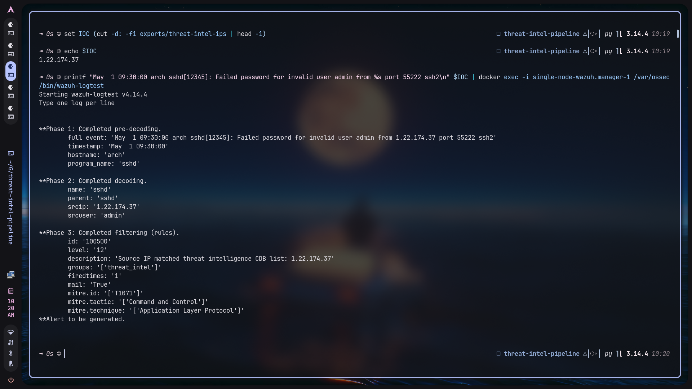

`wazuh-logtest` verifies rule behavior without waiting for a live endpoint to
generate logs. The test log contains an IOC from the exported IP CDB list, Wazuh
decodes it as `srcip`, checks it against the threat-intel list, and fires rule
`100500` at level `12`. This proves the detection logic works end to end:
feed IOC -> SQLite -> score -> export -> Wazuh CDB -> alert.

**E. Wazuh Dashboard Alert**

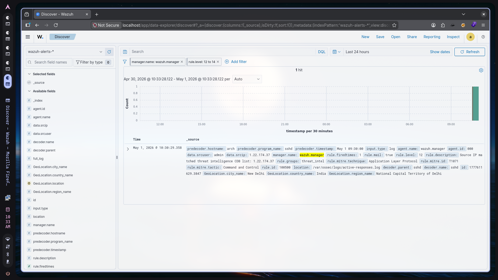

The dashboard screenshot shows the same detection surfaced in the analyst
interface. It includes the matched IOC, rule ID, severity, rule description,
manager name, and decoded event fields. This is the final operational proof:
the pipeline does not just generate files, it produces visible security events
that an analyst can triage in Wazuh.

---

### 6️⃣ Automation — systemd Timer

**A. Timer Status**

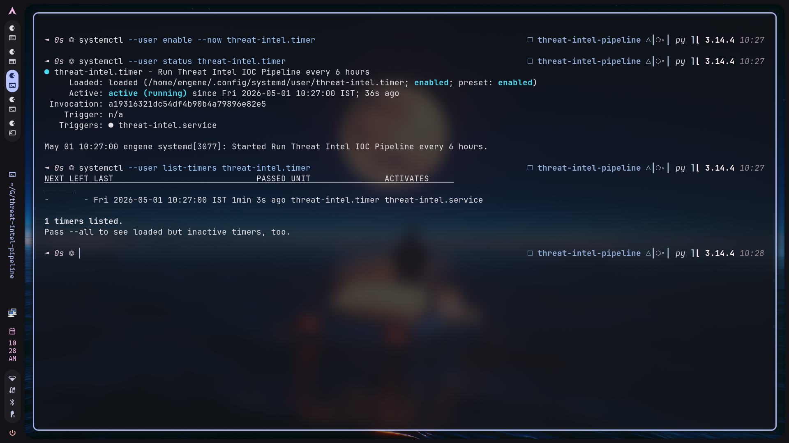

The timer status proves the pipeline can run continuously without manual
execution. The user-level systemd timer schedules the service every six hours,
which is appropriate for lightweight CTI refresh on an analyst workstation or
lab sensor. `Persistent=true` also means missed runs can be caught up when the
system comes back online.

**B. Journal Log of Automated Run**

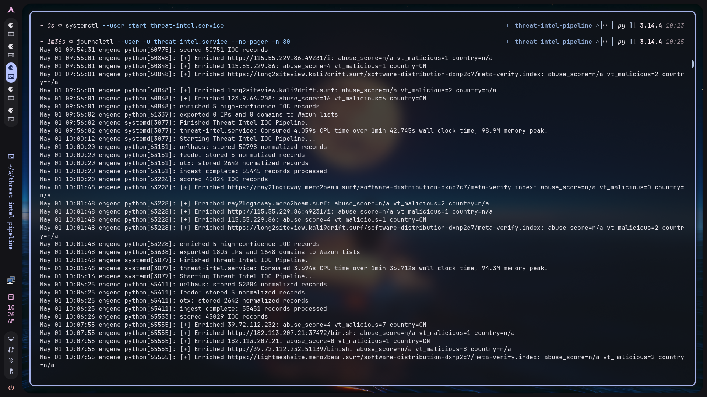

The journal output shows a full automated service execution: ingest, score,
sample enrichment, and export. This matters because automation is what turns
the project from a one-off script into a maintainable daemon-style pipeline.
The logs provide operational evidence for troubleshooting feed failures, API
issues, and export problems.

---

## 🗂️ Repository Structure

```text
threat-intel-pipeline/
├── README.md
├── WRITEUP.md
├── requirements.txt
├── config.py                  # API keys, thresholds, paths
├── cli.py                     # Entry point
├── pipeline/
│   ├── ingestors/
│   │   ├── base.py            # Abstract base ingestor
│   │   ├── urlhaus.py
│   │   ├── feodo.py
│   │   └── otx.py
│   ├── storage.py             # SQLite interface + deduplication
│   ├── scorer.py              # Confidence scoring engine
│   ├── enricher.py            # AbuseIPDB + VirusTotal enrichment
│   └── exporter.py            # Wazuh CDB writer
├── wazuh/
│   └── threat_intel_rules.xml # Custom Wazuh detection rules
├── assets/
│   ├── diagrams/              # Architecture diagram sources
│   └── screenshots/           # README screenshots
├── systemd/
│   ├── threat-intel.service
│   └── threat-intel.timer
└── data/                      # gitignored — DB lives here
```

---

## ⚙️ Setup

```bash
# 1. Clone and set up environment
git clone https://github.com/ibfavas/threat-intel-pipeline
cd threat-intel-pipeline
python -m venv .venv && source .venv/bin/activate
pip install -r requirements.txt

# 2. Set API keys
export OTX_API_KEY="your_key"
export ABUSEIPDB_API_KEY="your_key"
export VIRUSTOTAL_API_KEY="your_key"

# 3. Run the pipeline
python cli.py ingest
python cli.py score
python cli.py enrich
python cli.py export --wazuh
python cli.py report --top 20
```

Fish shell users should activate the virtual environment with:

```fish
source .venv/bin/activate.fish
```

**Free API keys:**
- OTX AlienVault → otx.alienvault.com
- AbuseIPDB → abuseipdb.com/api
- VirusTotal → virustotal.com/gui/my-apikey

### OTX Ingestion Volume

OTX can be slower than URLhaus and Feodo because it retrieves pulses and then
normalizes every indicator inside those pulses. The default OTX settings are:

```bash
TIP_OTX_LIMIT=100
TIP_OTX_MAX_PAGE=5
```

Fast screenshot run:

```bash
python cli.py ingest --otx-limit 10 --otx-max-page 3
```

Larger OTX pull:

```bash
python cli.py ingest --otx-limit 250 --otx-max-page 10
```

Skip OTX while testing:

```bash
python cli.py ingest --feeds urlhaus feodo
```

### Wazuh Export Paths

By default, `python cli.py export --wazuh` writes to the real Wazuh paths:

```text
/var/ossec/etc/lists/threat-intel-ips
/var/ossec/etc/lists/threat-intel-domains
```

Those paths require Wazuh/root permissions. For screenshots or local testing,
export to project-local files instead:

```bash
python cli.py export --wazuh \
  --ip-list exports/threat-intel-ips \
  --domain-list exports/threat-intel-domains
```

### Docker-Based Wazuh

If Wazuh is running in Docker, `/var/ossec/etc/lists` is inside the Wazuh
manager container, not on the host. Export locally first:

```bash
python cli.py export --wazuh \
  --ip-list exports/threat-intel-ips \
  --domain-list exports/threat-intel-domains
```

Find the manager container:

```bash
docker ps --format '{{.Names}}\t{{.Image}}\t{{.Status}}'
```

For the single-node Wazuh Docker deployment, the manager container is usually
named similar to `single-node-wazuh.manager-1`. Copy the generated CDB lists
and custom rule into the container:

```bash
docker cp exports/threat-intel-ips single-node-wazuh.manager-1:/var/ossec/etc/lists/threat-intel-ips
docker cp exports/threat-intel-domains single-node-wazuh.manager-1:/var/ossec/etc/lists/threat-intel-domains
docker cp wazuh/threat_intel_rules.xml single-node-wazuh.manager-1:/var/ossec/etc/rules/threat_intel_rules.xml
```

Register the custom CDB lists in the Wazuh manager configuration. This is
required so Wazuh loads the lists during analysis:

```bash
docker exec single-node-wazuh.manager-1 sh -lc "cp /var/ossec/etc/ossec.conf /var/ossec/etc/ossec.conf.bak-threat-intel && awk '1; /<list>etc\\/lists\\/malicious-ioc\\/malware-hashes<\\/list>/ { print \"    <list>etc/lists/threat-intel-ips</list>\"; print \"    <list>etc/lists/threat-intel-domains</list>\" }' /var/ossec/etc/ossec.conf > /tmp/ossec.conf && mv /tmp/ossec.conf /var/ossec/etc/ossec.conf"
```

Fix permissions and restart the Wazuh manager:

```bash
docker exec single-node-wazuh.manager-1 chown wazuh:wazuh /var/ossec/etc/lists/threat-intel-ips /var/ossec/etc/lists/threat-intel-domains
docker exec single-node-wazuh.manager-1 chmod 660 /var/ossec/etc/lists/threat-intel-ips /var/ossec/etc/lists/threat-intel-domains
docker exec single-node-wazuh.manager-1 /var/ossec/bin/wazuh-control restart
```

Screenshot checks:

```bash
docker exec single-node-wazuh.manager-1 head -15 /var/ossec/etc/lists/threat-intel-ips
docker exec single-node-wazuh.manager-1 head -15 /var/ossec/etc/lists/threat-intel-domains
docker exec single-node-wazuh.manager-1 cat /var/ossec/etc/rules/threat_intel_rules.xml
```

Direct logtest validation:

```bash
IOC=$(cut -d: -f1 exports/threat-intel-ips | head -1)
printf "May  1 09:30:00 arch sshd[12345]: Failed password for invalid user admin from %s port 55222 ssh2\n" "$IOC" | docker exec -i single-node-wazuh.manager-1 /var/ossec/bin/wazuh-logtest
```

Expected result: rule `100500`, level `12`, with description
`Source IP matched threat intelligence CDB list`.

---

## 🧠 How the Scoring Works

| Factor | Max Points | Logic |
|---|---|---|
| Recency | 40 | Linear decay over 30 days |
| Source reputation | 35 | Feodo 35 > URLhaus 30 > OTX 20 |
| Cross-feed corroboration | 25 | +5 per additional feed, capped at 25 |
| **Total** | **100** | IOCs ≥ 60 proceed to enrichment and export |

---

## 🔗 Data Flow

```text
OTX / URLhaus / Feodo
↓
[Ingestors] — normalize to unified schema
↓
[SQLite DB] — deduplicate, merge tags, increment hit_count
↓
[Scoring Engine] — recency + source weight + corroboration
↓
[Enricher] — AbuseIPDB + VirusTotal (score ≥ 60 only)
↓
[Wazuh Exporter] — CDB lists + ossec-control reload
↓
[Wazuh Rules] — real-time log correlation → alerts
```

---

## 📋 CLI Reference

| Command | Description |
|---|---|
| `python cli.py ingest` | Pull all feeds, normalize, store |
| `python cli.py ingest --feeds urlhaus feodo` | Pull only URLhaus and Feodo |
| `python cli.py ingest --otx-limit 100 --otx-max-page 5` | Pull all feeds with explicit OTX volume controls |
| `python cli.py score` | Run scoring engine over all IOCs |
| `python cli.py score --verbose --top 5` | Show scoring component breakdown |
| `python cli.py enrich` | Enrich high-score IOCs via APIs |
| `python cli.py enrich --limit 5 --verbose` | Enrich a small sample and print enrichment summaries |
| `python cli.py enrich --type ip --limit 5 --verbose` | Enrich IPs for AbuseIPDB/VirusTotal screenshot evidence |
| `python cli.py export --wazuh` | Push to Wazuh CDB lists |
| `python cli.py export --wazuh --ip-list exports/threat-intel-ips --domain-list exports/threat-intel-domains` | Export Wazuh CDB files locally for screenshots |
| `python cli.py report --top N` | Print top N IOCs by score |
| `python cli.py stats` | DB record count and feed health |

Verbose enrichment output prints concise screenshot-friendly summaries:

```text
[+] Enriched 1.2.3.4: abuse_score=85 vt_malicious=12 country=US
```

---

## 🔑 Key Takeaways

Not all IOCs are equal — a raw feed entry with no corroboration and a
30-day-old timestamp is much weaker signal than the same IP appearing
across three feeds this week. The scoring engine makes this distinction
explicit rather than treating every IOC as binary.

Enrichment should be selective — burning API rate limits on low-confidence
IOCs wastes quota and adds noise. Gating enrichment behind a confidence
threshold keeps the pipeline efficient on free-tier API keys.

The pipeline's real value is the Wazuh integration — IOCs sitting in a
database are intelligence. IOCs loaded into a live SIEM as CDB lookup
lists become detections.
